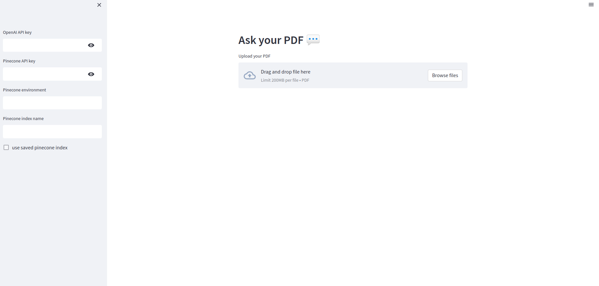

# langchain-ask-pdf-with-pinecone

This repo uses langchain to ask pdf and interact with pinecone

The code is modified from 
- https://github.com/alphasecio/langchain-examples/tree/main/pinecone-qa 
- https://github.com/alejandro-ao/langchain-ask-pdf/tree/main

#### App overview


Please fill in your 
- OpenAI API key
- Pinecone API key
- Pinecone environment
- Pinecone index name

The checkbox of `reuse pinecone index` will not called OpenAI embedding API to embed the documents. If the documents are already embed in the pinecone,
you can check the box to save your credit for OpenAI API. The checkbox will be automatically checked after you enter the first question, because the documents embedding will already be stored in your pinecone vector database.

#### Run code
1. Install requirements
```
pip3 install -r requirements.txt
```
2. Run the code
```
streamlit run app.py
```

#### Docker
1, Build docker
```
docker build -t streamlit .
```
2. Run docker
```
docker run --rm -p 8501:8501 streamlit
```